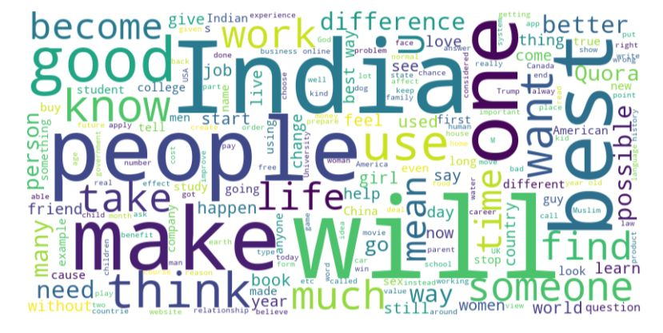

# Predicting Disaster Tweets using TF IDF
### A web app which classifies whether a given quora question is sincere or insincere using TF IDF - A beginner's approach to NLP

You can view the live demo [here](https://oyebamiji-micheal-quora-questions-classification-using-tf-idf.streamlit.app/).

 

## About the Project

<a href="https://quora.com/">Quora</a> is a platform that empowers people to learn from each other. On Quora, people can ask questions and connect with others who contribute unique insights and quality answers.  
This project is focused on predicting whether a given quora question is sincere or insincere. According to the data description on <a href="https://www.kaggle.com/competitions/quora-insincere-questions-classification/data">Kaggle</a>, insincere questions are those founded upon false premises, or that intend to make a statement rather than look for helpful answers. Other characteristics that can signify that a question is insincere include:

- Has an exaggerated tone to underscore a point about a group of people
- Suggests a discriminatory idea against a protected class of people, or seeks confirmation of a stereotype
- Makes disparaging attacks/insults against a specific person or group of people
- Based on false information, or contains absurd assumptions
- Uses sexual content (incest, bestiality, pedophilia) for shock value, and not to seek genuine answers

and so on...

My objective is to utilize NLP techniques to process and analyze the textual question to create a predictive model that can classify questions as sincere or not to some level of accuracy.  
Part of my objective also include familiarizing myself with fundamental NLP concepts, including tokenization, lemmatization, stop words removal, stemming, TD-IDF, and so on. In addition, I aim to gain hands-on experience in applying NLP techniques to real-world text data and understanding their impact on model performance.

